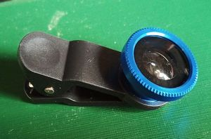
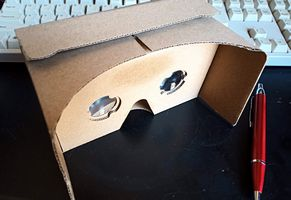

# Fisheye VR Expander
Easily take VR Photo using a cheap fisheye lense.  
This application can convert from fisheye image to 2D VR image(equirectangular image).  

## System Requirements
* Fisheye lense (180°)  

* VR Goggle  

* VR Player  
https://play.google.com/store/search?q=vr%20player&c=apps&hl=en

## Usage
*  take a fisheye photo  
previously attach a fisheye lense.
*  select a fisheye photo  

*  convert & save a image  
save to default picture directory.

## Next
You can view converted images by VR goggle.  
Also you can upload images to facebook or ...  

For Your Good VR Life.

© beerpedia.net
