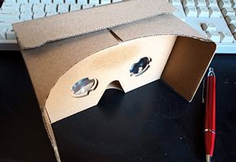

# Fisheye VR Expander
スマホに100均で買える魚眼レンズ(180°)を取り付けて撮影した画像を、VR表示可能な画像(正距円筒画像)に変換するアプリです。  
2Dの360°画像を作成することができます(表示できるのはカメラで撮影した前方のみ)。
このアプリを使うことで、誰でも気軽にVR画像を撮影することができるようになります。  

## 準備
* 魚眼レンズ(180°)  
キャン★ドゥやダイソーで購入できます。  

* VRゴーグル  
持っていない場合、これも100均で購入できます。  

* VR再生アプリ  
Google Playでお好きなアプリを選んでください。「VU Gallery VR 360 Photo Viewer」「Gizmo VRプレイヤー」「VaR's VR Video Player」など、大抵のアプリは静止画のVR表示に対応しています。  
https://play.google.com/store/search?q=vr%E5%86%8D%E7%94%9F&c=apps&hl=ja

## 使い方
*  カメラ撮影  
写真を撮影します。あらかじめ魚眼レンズを取り付けておいてください。
*  スマホ内画像選択  
デバイス内の魚眼画像を選択します。
*  画像変換  
撮影・選択した魚眼画像をVR表示用の画像に変換します。変換した画像は標準の画像ディレクトリに保存されます。
## それから
変換した画像は、VRプレーヤで鑑賞したり、Facebookにアップロードしたりすることができます。  
どうぞ楽しいVR体験を。

© beerpedia.net

