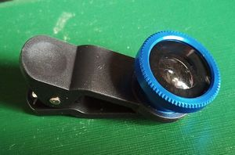
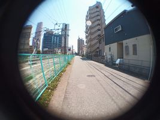
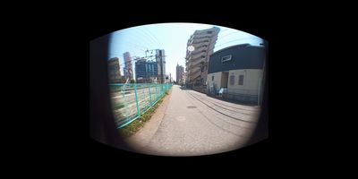

# Fisheye2VREquirectangular
魚眼画像を正距円筒画像に変換するアプリです。  
100均で買える程度の180°魚眼レンズで、VR可能な正距円筒画像を生成します。360°画像として生成しますが、後ろは真っ暗です。  
   

## 参考
* 写真を撮影する(https://developer.android.com/training/camera/photobasics?hl=ja)
* 一般的なインテント(https://developer.android.com/guide/components/intents-common)
* https://www.facebook.com/notes/eric-cheng/editing-360-photos-injecting-metadata/10156930564975277/
* https://medium.com/@star_zero/android-q%E3%81%AEscoped-storage%E3%81%AB%E3%82%88%E3%82%8B%E5%A4%89%E6%9B%B4-afe41cde9f35
* https://developer.android.com/jetpack/androidx/releases/exifinterface?hl=ja
* https://qiita.com/j_catfish/items/3a419fb9c288a3b8994f
